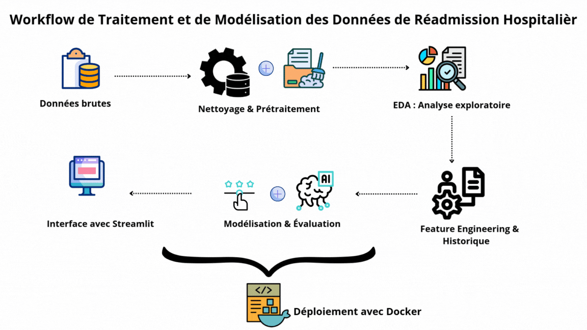

# Diabetes Readmission Prediction Project

## Overview

This project aims to predict the likelihood of a patient with diabetes being readmitted to a hospital within 30 days after discharge. The dataset used includes various features about the patients and their medical conditions, with the goal of leveraging machine learning algorithms to make accurate predictions. The model helps in reducing hospital readmissions and improving healthcare outcomes.

## Dataset

The dataset used for this project is the **Diabetes 130-US hospitals for years 1999-2008** dataset, available on [UCI Machine Learning Repository](https://archive.ics.uci.edu/dataset/296/diabetes+130-us+hospitals+for+years+1999-2008). It contains patient demographics, medical history, and hospital-related data, which are used to predict readmission.

### Key Features
- **Age**: Age of the patient
- **Admission Type ID**: Type of admission
- **Discharge Disposition ID**: Discharge status
- **Number of Lab Procedures**: Number of lab procedures performed
- **Max Glucose Serum**: Maximum glucose level of the patient
- **A1C Result**: A1C test results
- **Medications**: Medication details (Metformin, Insulin, etc.)

## Methodology

### Data Preprocessing
- **Missing Values Handling**
- **Categorical Encoding**:
- **Normalization**:
### Feature Engineering

- **Interaction Features**: New features were generated based on combinations of existing features that may provide additional predictive value.
- **Feature Importance**
- **Create patient historical data**

### Model Development
Several machine learning algorithms were tested, including:
- **Random Forest**
- **XGBoost**

The final model was selected based on cross-validation performance and hyperparameter tuning.

### Model Deployment
The trained model was deployed as a web API using **FastAPI**, allowing for easy integration with a user interface built using **Streamlit**. The deployed model can predict diabetes readmissions based on input provided by healthcare professionals.

## Workflow Diagram



## Future Work
- **Model Improvement**: Exploring more advanced models such as deep learning models methods for better performance.
- **Real-Time Data Integration**: Integrating the model into a healthcare system to provide real-time predictions based on patient data.
- **Enhanced Features**: Including additional features such as patient lifestyle data (e.g., diet, exercise) could improve the model's accuracy.
- **Add XAI Component**

## Installation and Setup

### Prerequisites

1. Install the required libraries:
   ```bash
   poetry install
   ```

2. Start the FastAPI server:
   ```bash
   cd readmission-app/api/
   uvicorn app:app --host 0.0.0.0 --port 8000
   ```

3. Run the Streamlit app:
   ```bash
   cd readmission-app/streamlit-app/
   streamlit run app.py
   ```

## License

This project is licensed under the MIT License.
